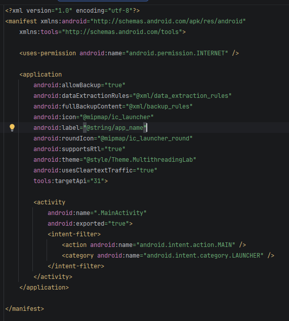
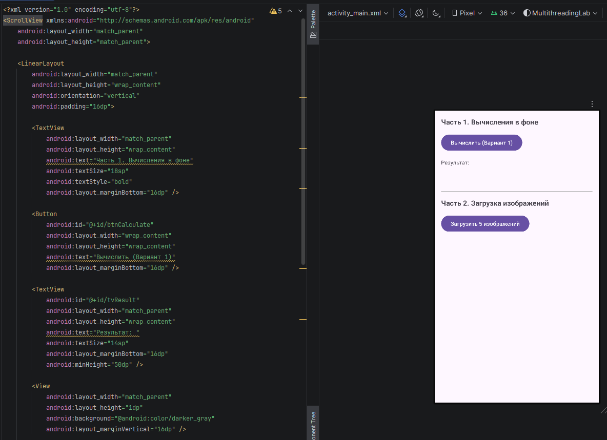
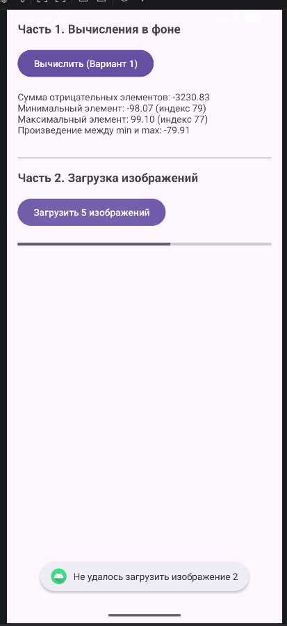

<div align="center">

# Отчет

</div>

<div align="center">

## Практическая работа №11

</div>

<div align="center">

## Многопоточность в Android. Асинхронная загрузка данных

</div>

**Выполнил:**  
Покидов Матвей Юрьевич

**Курс:** 2

**Группа:** ИНС-б-о-24-1

**Направление:** 09.03.02

**Профиль:** Информационные системы и технологии

**Проверил:**  

Потапов Иван Романович

---

### Цель работы

Изучить принципы многопоточного программирования в Android. Научиться выносить длительные операции (вычисления, загрузка данных из сети) в фоновые потоки, чтобы избежать блокировки пользовательского интерфейса. Освоить способы обновления UI из фоновых потоков с использованием современных подходов (`ExecutorService` и `Handler`).

---

### Ход работы

### Задания для самостоятельного выполнения(1вариант)

#### 1. Создание интерфейса пользователя и настройка проекта

Был создан новый проект `MultithreadingLab`. В файл манифеста (`AndroidManifest.xml`) было добавлено разрешение на работу с интернетом, а также атрибут `usesCleartextTraffic` для возможности загрузки изображений в тестовых целях.

<div align="center">



**Рисунок 1** — Файл манифеста с разрешением INTERNET и настройками безопасности

</div>

Интерфейс приложения (`activity_main.xml`) содержит кнопки для запуска вычислений и загрузки изображений, текстовое поле для вывода результатов вычислений, прогресс-бар и контейнер для динамического добавления изображений.

<div align="center">



**Рисунок 2** — Разметка главного экрана приложения

</div>

#### 2. Реализация вычислений в фоновом потоке

Для выполнения вычислений использовался `ExecutorService` с одним потоком (`newSingleThreadExecutor()`). При нажатии на кнопку «Вычислить» в фоновом потоке генерируется массив из 100 случайных вещественных чисел, после чего находятся сумма отрицательных элементов и произведение элементов между максимальным и минимальным значением. 

<div align="center">



**Рисунок 3** — Успешное завершение вычислений в фоновом потоке

</div>

#### 3. Реализация загрузки изображений

При нажатии на кнопку «Загрузить 5 изображений» запускается фоновый поток, который последовательно загружает изображения по URL-адресам с сервиса `picsum.photos`. После загрузки каждого изображения обновляется прогресс-бар, а само изображение через `Handler` добавляется в `LinearLayout` на главном экране.

В ходе выполнения возникла ошибка загрузки одного из изображений (ошибка сети или таймаут), что было корректно обработано в коде: пользователю было показано уведомление «Не удалось загрузить изображение 2», при этом загрузка остальных изображений продолжилась.

<div align="center">


**Рисунок 4** — Загрузка изображений с обработкой ошибки сети

</div>

---

### Вывод

В ходе выполнения практической работы №11 (самостоятельное задание, вариант 1):

1.  **Изучены принципы многопоточности в Android:** рассмотрена роль главного (UI) потока и причины, по которым в нем нельзя выполнять длительные операции (зависание интерфейса, ANR).
2.  **Освоена работа с фоновыми потоками:** реализовано создание и управление потоками с использованием современного подхода на базе `ExecutorService` и `Handler`.
3.  **Реализована асинхронная загрузка данных:** успешно выполнена загрузка изображений из сети без блокировки пользовательского интерфейса.
4.  **Настроено отображение прогресса:** использован `ProgressBar` для информирования пользователя о ходе выполнения фоновых задач.
5.  **Обработаны исключительные ситуации:** реализована обработка ошибок сети при загрузке изображений с выводом соответствующего уведомления.

---

### Ответы на контрольные вопросы

**1. Что такое главный (UI) поток? Почему нельзя выполнять длительные операции в нём?**
Главный поток (UI-поток) отвечает за отрисовку интерфейса и обработку событий (касания, нажатия). Если в нем выполняется длительная операция (более 5 секунд), интерфейс перестает реагировать на действия пользователя («зависает»), и система может выдать ошибку ANR (Application Not Responding).

**2. Что такое ANR (Application Not Responding)? При каких условиях возникает?**
ANR — это диалоговое окно, которое показывает система, когда приложение перестает отвечать на действия пользователя. Возникает, если UI-поток заблокирован длительной операцией (обычно более 5 секунд).

**3. Как создать новый поток в Java? Как запустить выполнение кода в этом потоке?**
Новый поток создается с помощью класса `Thread` или интерфейса `Runnable`. Запуск осуществляется методом `start()`.
```kotlin
val thread = Thread {
    // Код, выполняемый в фоне
}
thread.start()
```

**4. Почему нельзя обновлять UI из фонового потока напрямую? Как правильно обновить интерфейс из другого потока?**
Потому что компоненты UI не являются потокобезопасными (thread-safe). Прямое обращение из другого потока может привести к непредсказуемым ошибкам и исключениям. Для обновления UI необходимо использовать механизмы синхронизации с главным потоком: `Activity.runOnUiThread()`, `View.post()` или `Handler` с `Looper.getMainLooper()`.

**5. Для чего используется класс Handler? Как с его помощью отправить сообщение в UI-поток?**
`Handler` позволяет отправлять и обрабатывать объекты `Message` и `Runnable` в очередь сообщений конкретного потока.
```kotlin
val mainHandler = Handler(Looper.getMainLooper())
mainHandler.post {
    // Этот код выполнится в UI-потоке
    textView.text = "Готово"
}
```

**6. Что такое ExecutorService? В чём его преимущество перед созданием потоков вручную?**
`ExecutorService` — это фреймворк для управления пулом потоков. Преимущества: автоматическое переиспользование потоков, управление очередью задач, возможность гибкой настройки количества потоков. Это эффективнее и безопаснее, чем создавать `new Thread()` каждый раз вручную.

**7. Почему AsyncTask считается устаревшим? Какие альтернативы рекомендуется использовать?**
`AsyncTask` устарел из-за проблем с утечками памяти при повороте экрана, сложностей с обработкой ошибок и ограничений параллелизма. Альтернативы: `java.util.concurrent` (`ExecutorService`, `Handler`), Kotlin Coroutines, RxJava, WorkManager (для отложенных задач).

**8. Как отобразить прогресс выполнения длительной операции с помощью ProgressBar?**
Нужно сделать `ProgressBar` видимым (`visibility = View.VISIBLE`), установить максимальное значение (`max`), и по мере выполнения задачи в фоновом потоке отправлять обновления в UI-поток через `Handler` для изменения текущего прогресса (`progress`). По завершении скрыть индикатор.
